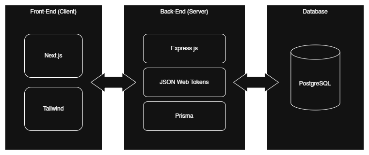
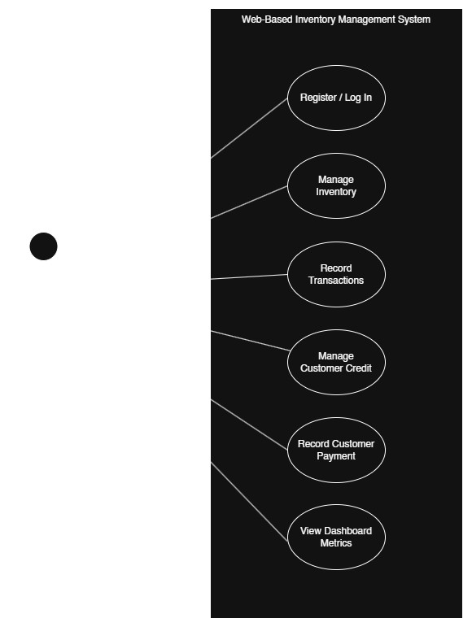
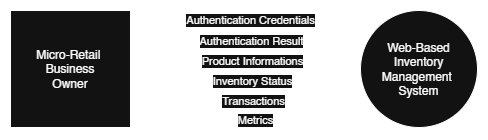
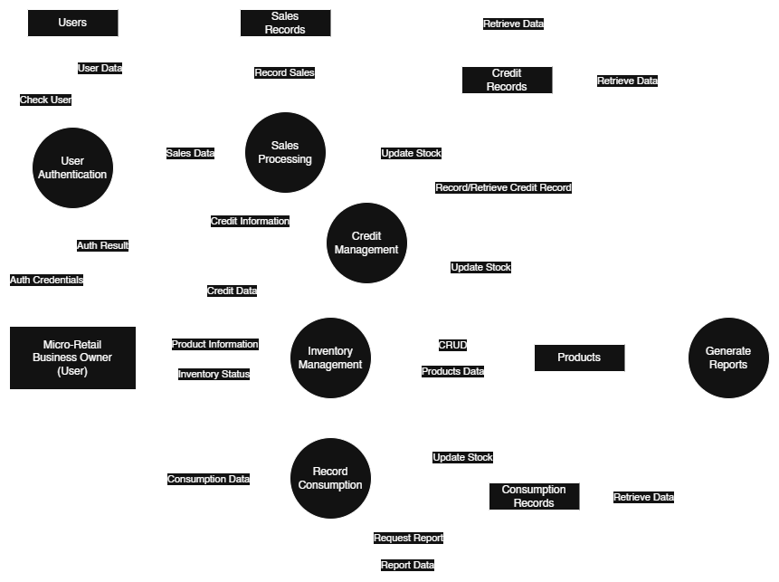
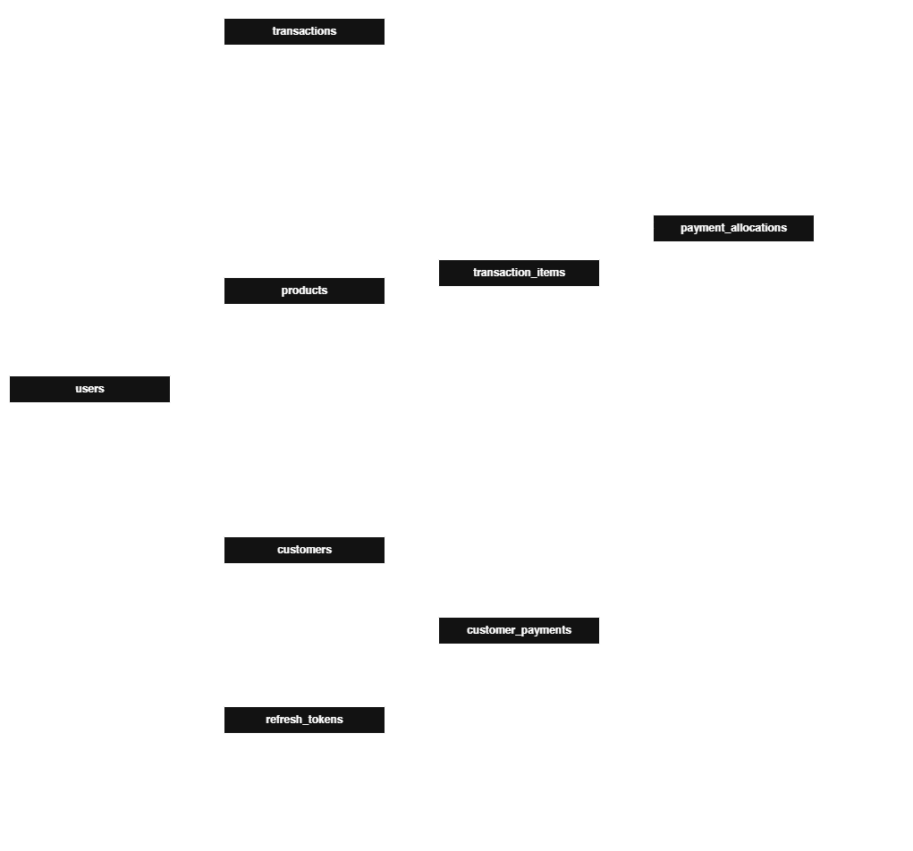

# Architecture Documentation

This document outlines the overall architecture of the backend service, including the folder structure, modules, and components.

## Folder Structure

The backend service follows a modular structure with the following directories:

- `prisma/`: Contains the Prisma schema and migration files for database management.
- `src/`: Contains the main source code for the application.
    - `lib/`: Contains utility functions and shared modules used across the application.
    - `modules/`: Contains the main modules of the application, each responsible for a specific domain or feature.
        - `auth/`: Contains authentication-related logic, including JWT handling and user authentication.
        - `categories/`: Contains logic related to managing categories in the application.
        - `credits/`: Contains logic related to managing customer credits in the application.
        - `dashboard/`: Contains logic related to the dashboard feature of the application.
        - `products/`: Contains logic related to managing inventory products in the application.
        - `transactions/`: Contains logic related to managing transactions in the application.
        - `user/`: Contains logic related to profile management and user-related operations.
    - `shared/`: Contains shared components, such as middleware, error handling, and common utilities.
        - `error/`: Contains global error handling logic and custom error classes.
        - `middleware/`: Contains middleware functions for request processing, such as authentication and validation.
- `app.ts`: The main entry point of the application, responsible for initializing the Express server and setting up routes and middleware.
- `server.ts`: The server configuration file, responsible for starting the Express server and handling server-level configurations.

### Modules and Components

Each module in the `modules/` directory is designed to encapsulate a specific domain or feature of the application. The modules interact with each other through well-defined interfaces and follow the principles of separation of concerns.

Each module typically contains the following components:
- `routes`: Contains the route definitions for the module, mapping HTTP endpoints to controller functions.
- `controllers`: Contains the route handlers and business logic for the module.
- `services`: Contains the service layer, responsible for interacting with the database and performing business operations.
- `repositories`: Contains the data access layer, responsible for querying the database and returning results to the service layer.
- `schema`: Contains the data validation schemas for incoming requests, using zod for schema validation.

## System Architecture Diagrams

The following diagrams illustrate the overall architecture of the backend service, including the flow of data and interactions.

### 1. High-Level Architecture Diagram

- The backend service follows a 3-tier architecture, consisting of the frontend client, backend service, and database.

Frontend Client: The frontend application is built using Next.js and communicates with the backend service through RESTful APIs.
Backend Service: The backend service is built using Express.js and handles incoming requests, processes business logic, and interacts with the database.
Database: The database is managed using PostgreSQL and Prisma ORM.

### 2. Use Case Diagram

- The use case diagram illustrates the interactions between users and the backend service, highlighting the main functionalities provided by the application.

### 3. Data Flow Diagram (Level 0)

- The level 0 data flow diagram provides a high-level overview of the data flow within the backend service, showing how requests are processed and how data is retrieved from the database.

### 4. Data Flow Diagram (Level 1)

- The level 1 data flow diagram provides a more detailed view of the data flow within the backend service, showing how requests are processed and how data is retrieved from the database.

### 5. Entity-Relationship Diagram (ERD)

- The entity-relationship diagram illustrates the relationships between different entities in the database, providing a visual representation of the data structure.

